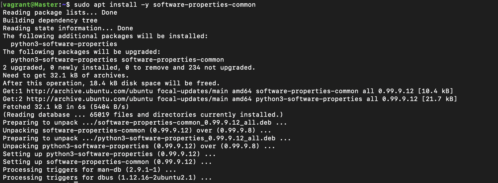
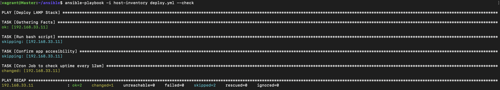

# ALTSCHOOL CLOUD EXAM ONE

This repo contains my solution for my altschool second semester examination.

**Name: Ilodiuba Victor Nnamdi**
**School: School of Engineering**
**Track: Cloud Engineering**
**ID No: ALT/SOE/023/3812**

## Table of Contents

- [Objective](#objective)
- [Requirements](#requirements)
- [Required files](#required-files)
- [Solution](#solution)
    - [Bash script breakdown](#bash-script-breakdown)
    - [Vagrantfile breakdown](#vagrantfile-breakdown)
    - [Playbook breakdown](#playbook-breakdown)

## Objective

- Automate the provisioning of two Ubuntu-based servers, named “Master” and “Slave”, using Vagrant.

- On the Master node, create a bash script to automate the deployment of a LAMP (Linux, Apache, MySQL, PHP) stack.

- This script should clone a PHP application from GitHub, install all necessary packages, and configure Apache web server and MySQL. 

- Ensure the bash script is reusable and readable.

- Using an Ansible playbook:

    - Execute the bash script on the Slave node and verify that the PHP application is accessible through the VM’s IP address (take screenshot of this as evidence).

    - Create a cron job to check the server’s uptime every 12 am.

## Requirements

- Submit the bash script and Ansible playbook to (publicly accessible) GitHub repository.

- Document the steps with screenshots in md files, including proof of the application’s accessibility (screenshots taken where necessary)

- Use either the VM’s IP address or a domain name as the URL.

## Required files

- [Bash Script](lamp.sh)

- [Ansible Playbook](deploy.yml)

## Solution

- On my host system, i created a directory name `altschool-cloud-exam-1` in home directory using `mkdir altschool-cloud-exam-1` and changed my working directory to it using `cd altschool-cloud-exam-1`.

- I created a bash script named [lamp.sh](lamp.sh) containing commands to Install a Linux, Apache, MySQL, PHP stack. This bash script also configures firewall rules, creates a database and user for the MySQL server, install the necessary dependencies and extensions for the laravel app. For a breakdown of the bash script, see [Bash script breakdown](#bash-script-breakdown).

- This is what the apache base directory looks like after the script is successfully completed:


- I created a Vagrantfile using `vagrant init` and edited the configurations of the file to provision two servers named `Master` and `Slave` as seen in the file [Vagrantfile](./Vagrantfile). For a breakdown of the Vagrantfile, see [Vagrantfile breakdown](#vagrantfile-breakdown).

- I then deployed the servers using `vagrant up`.


- After vagrant completed the provisioning, i SSH into the `Master` server with `vagrant ssh Master`


- Then i installed ansible as shown in the pictures below:
    - `sudo apt install software-properties-common`

    - `sudo add-apt-repository --yes --update ppa:ansible/ansible`

    - `sudo apt install ansible`


- Then i created a new ssh key pair using `ssh-keygen`.


- Then i open a new terminal window on my host system and SSH into my `Slave` node. I then copied my public key from my `Master` node to `~/.ssh/authorized_ keys` on my `Slave node`.


- Then i returned to my `Master` node and created a new directory in the home directory named `ansible` and changed my working directory to it using:

```bash

mkdir ansible && cd ansible

```

- In this directory, i created my [ansible playbook](deploy.yml) to execute the [lamp.sh](lamp.sh) bash script on the Slave node and create a cron job and my [host inventory](./host-inventory) named `deploy.yml` and `host-inventory` respectively. For a breakdown of the playbook, see [Playbook breakdown](#playbook-breakdown).

- I then checked my playbook using `ansible-playbook -i host-inventory deploy.yml --check`  and no error was returned.


- Then i ran my ansible playbook using `ansible-playbook -i host-inventory deploy.yml` and all tasks were successfully completed.


- This is a screenshot of the PHP app running on the `Master` node:


- This is a screenshot of the PHP app running on the `Slave` node:


### Bash script breakdown

-  Before using the bash script, ensure `DB_DATABASE`, `DB_USERNAME`, `DB_PASSWORD` and `DB_CONNECTION` are set to the right values. This can be done on the part of the script containing:

```bash
#!/usr/bin/env bash

export COMPOSER_ALLOW_SUPERUSER=1
export DB_DATABASE=example_database #change to your preferred database name
export DB_USERNAME=example_user #change to your preferred username
export DB_PASSWORD=password #change to your preferred password
export DB_CONNECTION=mysql

```

- The script then updates the local package index, installs apache, adjusts the firewall, and  enables apache on boot with these commands:

```bash

echo "Updating Repository Index..."
apt -y update
clear

echo "Installing Apache..."
apt install -y apache2
clear

echo "Adjusting Firewall.."
ufw allow ssh
ufw allow in "Apache Full"
clear

echo "Enabling Apache on boot up..."
systemctl enable apache2
clear

```

- Then it installs MySQL and creates a database and user with the provided values with these commands:

```bash

echo "Installing MySQL..."
apt install -y mysql-server
clear

echo "Configuring MySQL DB..."
mysql -e "CREATE DATABASE IF NOT EXISTS $DB_DATABASE;"
mysql -e "CREATE USER IF NOT EXISTS '${DB_USERNAME}'@'%' IDENTIFIED BY '${DB_PASSWORD}';"
mysql -e "GRANT ALL ON $DB_DATABASE.* TO '${DB_USERNAME}'@'%';"

```

- Then it installs PHP version 8.3 and required dependencies for the app using these commands:

```bash

echo "Installing PHP and it's required extensions..."
add-apt-repository -y  ppa:ondrej/php
apt install -y php8.3 libapache2-mod-php php-mysql php-xml php-curl php-zip unzip
clear

```

- Then it clones the git repository and copies it to the default apache base directory using these commands:

```bash

if ! [ -f ~/laravel ]; then
	echo "Cloning Laravel Repo from GitHub..."
	git clone https://github.com/laravel/laravel.git
	clear
fi

echo "Setting Up Project"
rm -rf /var/www/html/*
cp -r laravel/* /var/www/html/
clear

```

- Then it installs `composer` which is required to install dependencies for the laravel app and then subsquently install the dependencies with these commands:

```bash

if ! [ -f /usr/local/bin/composer ]; then
	echo "Installing Composer..."
	wget https://getcomposer.org/download/2.6.6/composer.phar # Downloads the composer.phar  file
	chmod u+x composer.phar
	mv composer.phar /usr/local/bin/composer
	chown vagrant /usr/local/bin/composer
fi
clear

echo "Installing App Dependencies..."
cd /var/www/html/
composer update
composer install
clear

```

- Then it sets up the environment variables file `.env` containing variables that the laravel app requires to work with:

```bash

echo "Configuring App Variables..."
bash -c "echo -e APP_KEY= > .env"
bash -c "echo APP_ENV=local >> .env"
bash -c "echo -e DB_CONNECTION=$DB_CONNECTION >> .env"
bash -c "echo -e DB_USERNAME=$DB_USERNAME >> .env"
bash -c "echo -e DB_PASSWORD=$DB_PASSWORD >> .env"
bash -c "echo -e DB_DATABASE=$DB_DATABASE >> .env"
php artisan key:generate # Generates the app key laravel uses to encrypt sessions and adds it to the "APP_KEY" variable in the .env file
php artisan migrate:refresh # Publishes the schema to the databse and clears the previous cache
clear

```

- Then it restarts the apache service using:

```bash
systemctl restart apache2
```

- PHP apps require a `755` permission to be able to run, and since the app is being served by the vagrant user, the ownership of the files should be set to `vagrant`. The script does this with:

```bash

echo "Setting correct permissions for files..."
chmod -R  755 /var/www/html/*
chown -R vagrant:vagrant /var/www/html/*
clear

```

`755` means the user has read,  write and  execute permissions, the group has read and execute permissions and others have read and execute permission.

### Vagrantfile breakdown


As seen in the image above, the configuration of the vagrantfile is set to provision two ubuntu-based servers named `Master` and `Slave`. It also adds them to a private network and sets their  IP Address to `192.168.33.10` and `192.168.33.11` respectively.

- For the Master server, the `master.vm.provision` line configures vagrant to use the shell provisioner to set up the machine with the bash script file [lamp.sh](lamp.sh).

### Playbook breakdown


As seen in the image above, the ansible playbook runs two tasks on my `slave` server.

- The first task named `Run bash script` uses the [lamp.sh](lamp.sh) bash script to deploy the LAMP stack, install all required packages and run the correct configurations on the `slave` server.

- The second task named `Cron Job to check uptime every 12am` creates a con job that checks the server's uptime every day at 12am.

- My host inventory contains only the `slave` server as shown below:


- The `ansible_user=vagrant` tells ansible to SSH to the `vagrant` user instead of the `root` user.
